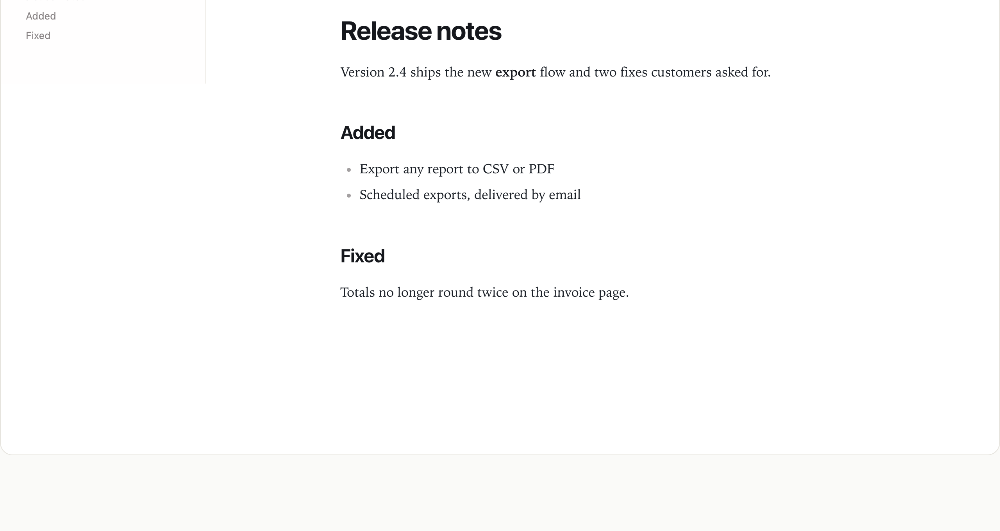

# Osysharp.MarkdownEditor — a rich markdown editor

A full editor over a `Markdown` property: rich and source modes, a document outline, find and replace, tables, maths
and diagrams. It saves only the sections that changed.

## Use case

Any app where people write long-form text that should stay plain markdown underneath — release notes, a knowledge
base, meeting minutes, product descriptions, support articles. Point the editor at a row's `Markdown` property and the
people writing get a real editor, while your data stays portable text that diffs, searches and renders anywhere.
Maths and diagrams load only when a document uses them, so a page of prose never pays for them.



## Install

```osy
// app.osy
app Handbook {
  use Osysharp.MarkdownEditor@1;
  model "model/**/*.osy";
}
```

```console
osy lock      # resolves the package and pins its content address in osyrin.lock
```

## Using it

```osy
using Osysharp.MarkdownEditor;

entity Article {
  [Required] string Title;
  Markdown Body;
  security { allow read, update when IsAuthenticated; }
}

[Route("/articles/{id}")]
component ArticlePage(Guid id) {
  render {
    MarkdownEditor(ownerType: "Article", ownerId: id, property: "Body", outline: true);
  }
}
```

The editor reads and writes the property itself, through your app's own security rules — a reader who may not update
the row gets a read-only document.

| prop | default | what it does |
|---|---|---|
| `ownerType` · `ownerId` · `property` | — | which row's `Markdown` property the document is |
| `readOnly` | `false` | show the document without editing |
| `placeholder` | `""` | text shown in an empty document |
| `face` | `editorial` | the reading typeface: `editorial`, `sans` or `serif` |
| `density` | `comfortable` | `comfortable` or `compact` |
| `outline` | `false` | the heading outline beside the document |
| `findQuery` · `replaceWith` | — | drive find and replace from your own toolbar |
| `extraItems` | `[]` | your own entries in the block menu, as `MenuEntry { Label, Run }` |

It raises `saved(updated, created, deleted)`, `dirty(isDirty)`, `findRequested(selection)` and
`matchesChanged(current, total)`, and takes the commands `FindNext`, `FindPrev`, `ReplaceOne`, `ReplaceAll`,
`ClearFind`, `DeleteBlock` and `TurnIntoHeading(level)`.

## Build your own on top

**Add to it without forking.** The `Toolbar` slot is yours — put your own buttons in it, wired to the editor's
commands — and `extraItems` adds your own actions to the block menu:

```osy
MarkdownEditor(ownerType: "Article", ownerId: id, property: "Body",
  extraItems: [ new MenuEntry { Label = "Make it a heading", Run = () => MarkdownEditor.TurnIntoHeading(2) } ]) {
  slot Toolbar { c =>
    Row(gap: 1) {
      Button("Find next", onClick: c.FindNext);
    }
  }
}
```

**Fork it.** Fork this repository into your own GitHub account or organisation and rename the package to match —
`package Acme.Markdown` lives at `github.com/acme/markdown`, because a package's owner *is* its GitHub owner. The
control is a TypeScript shim over Milkdown and CodeMirror, built with the ordinary CLI:

```console
npm install
npm run chunks          # rebuild the maths and diagram chunks from node_modules
osy control build .     # regenerate the typed ABI, type-check the shim against it, bundle it, re-pin osyrin.lock
osy publish             # check the package and create the release
```

`markdown.control.check.ts` is generated from the declaration so `tsc` proves the shim uses only the public control
ABI — the same one your own controls get. Nothing in this package is privileged, which is what makes it a fair
starting point for a control of your own.

To work on your fork next to an app before publishing, list its directory in an `osy.workspace` file at your
repository root; a `use` of it then resolves to your local copy.

### What is in the source

| file | what it is |
|---|---|
| `markdown.osy` | the `control MarkdownEditor` declaration — the kit's whole public surface |
| `markdown.ts` + siblings | the shim source (Milkdown, CodeMirror 6, the section-identity map) |
| `markdown.js` | the bundled shim, checked in — what a consumer's browser loads |
| `temml.js` / `temml.css` | the `Math` and `MathCss` chunks — 228 KB a document of prose never pays for |
| `diagrams/` | the `Diagrams` PACKAGE chunk: mermaid's 28 KB entry plus the engines one diagram actually reaches |
| `osyrin.lock` | the kit's OWN pins — bundle + chunks by content address. |
| `markdown.control.d.ts` / `.check.ts` | GENERATED by `osy control build` — the ABI, and the line that holds the shim to it |

## Licence

MIT &mdash; see [`LICENSE`](LICENSE). The `.osy` source is yours to read, copy, fork and ship.

The vendored bundle wraps Milkdown, CodeMirror 6, Mermaid and Temml (all MIT), which keep their own terms;
[`LICENSE`](LICENSE) names them. Versions are pinned in `package.json` and by content address in `osyrin.lock`.
